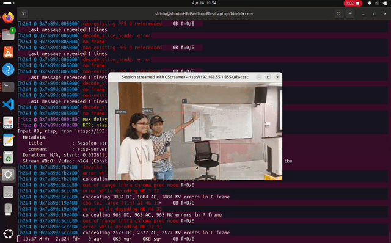

# Object detection using NVIDIA Deepstream
This repository contains step-by-step instructions on how to run NVIDIA Deepstream for object detection on video stream, implemented on NVIDIA Jetbot.
<br>
<br>
## Demo


## Instructions
1. To log in to your Jetson terminal from remote host, use
   ```bash
   ssh <username>@<jetson_ip_address>
   
2. Pull the deepstream container image from [NGC catalog](https://catalog.ngc.nvidia.com/orgs/nvidia/containers/deepstream) according to the version of your Jetson.
   ```bash
   sudo docker pull nvcr.io/nvidia/deepstream-l4t:<version>
   
3. You'll be able to see the deepstream image by running
   ```bash
   sudo docker images

4. Run the deepstream container using
   ```bash
   sudo docker run -it --rm --runtime=nvidia --network host -v <host_directory>:<container_directory> nvcr.io/nvidia/deepstream-l4t:<version>

5. Navigate to the samples/trtis-model-repo and choose any model. I have used ssd-mobilenet-v1-coco2018
   
6. Download an object detection model from [TensorFlow Object Detection Zoo](https://example.com)

7. Unzip the file using
   ```bash
   tar -xvf <model-file-path>
   
8. Copy the model file in ssd-mobilenet-v1/1/ as .graphdef
   ```bash
   cp frozengraph.pb ssd-mobilenet-v1/1/mobile.graphdef

9. Modify the config and source files as provided in the repository.
10. Run the application as follows
    ```bash
    deepstream-app -c <name-of-source-file>.txt

   
